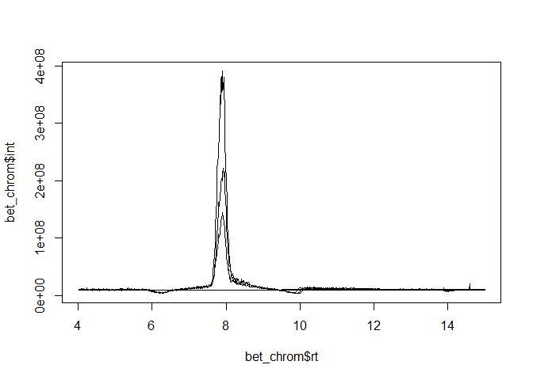
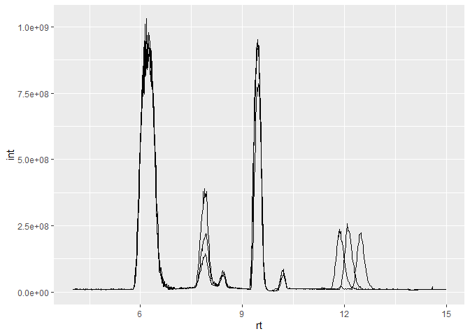
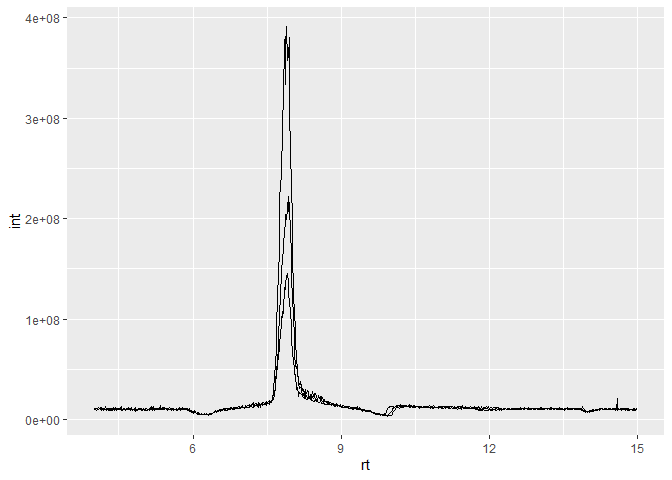
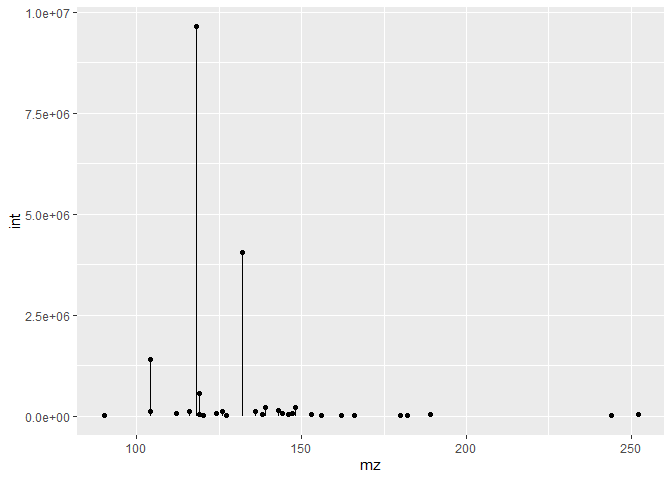
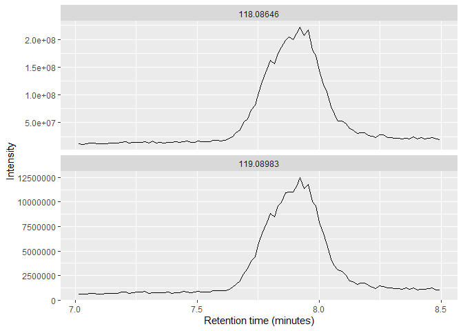

Converting mzML files to databases
================

Mass-spec data is inherently simple, but the file types and programming
constructions rarely make this clear. Databases are a natural choice for
MS data and largely abstract away the nuances of any particular language
via SQL. This package provides a very basic method in R of converting
the MS1 and MS2 data in mzML files into databases (currently SQLite and
DuckDB) that allows for rapid subset retrieval (e.g. chromatogram or
spectrum) in a language-agnostic fashion.

## Install via Github

``` r
devtools::install_github("wkumler/mzml2db", build_vignettes = TRUE)
```

Load like every other package:

``` r
library(mzml2db)
```

## Core functionality: mzml2db

`mzml2db` takes in a list of mzML files and extracts the MS1 and MS2
data from them into database tables. The MS1 table has fields for
filename, retention time (rt), m/z ratio (mz), and intensity (int). The
MS2 table has columns for filename, retention time, precursor m/z
(premz), fragment m/z (fragmz), and intensity (if the files have MS2
information in them). The type of database produced can be specified as
a connection object such as `duckdb::duckdb()` or `RSQLite::SQLite()`,
with authentication-based server-side databases like Postgres coming in
another update.

``` r
# Use some demo files from the RaMS package
library(RaMS)
ms_files <- list.files(system.file("extdata", package="RaMS"),
                       pattern = "mzML", full.names = TRUE)[2:4]


# SQLite is well supported but large (~3x mzML size)
mzml2db(ms_files, db_engine = RSQLite::SQLite(), db_name = "minidata.sqlite")
```

    ## [1] "Starting scan #0"
    ## [1] "Writing final data to database"
    ## [1] "Starting scan #0"
    ## [1] "Writing final data to database"
    ## [1] "Starting scan #0"
    ## [1] "Writing final data to database"

    ## [1] "minidata.sqlite"

``` r
# Initialize DuckDB database (nice because it's smaller and faster)
mzml2db(ms_files, db_engine = duckdb::duckdb(), db_name = "minidata.duckdb")
```

    ## [1] "Starting scan #0"
    ## [1] "Writing final data to database"
    ## [1] "Starting scan #0"
    ## [1] "Writing final data to database"
    ## [1] "Starting scan #0"
    ## [1] "Writing final data to database"

    ## [1] "minidata.duckdb"

## Data extraction

Once the data’s in a database, interfacing with it is the exact same as
any other database, allowing for complex queries.

``` r
library(DBI)
conn <- dbConnect(duckdb::duckdb(), "minidata.duckdb")
```

You can write raw SQL to extract chromatograms or other swaths of data:

``` r
bet_chrom <- dbGetQuery(conn, "SELECT * FROM MS1 WHERE mz BETWEEN 118.086 AND 118.087")
plot(bet_chrom$rt, bet_chrom$int, type="l")
```

<!-- -->

Or do more complicated things like calculating BPC/TICs and using
`ggplot2`:

``` r
library(ggplot2)
bpc_query <- "SELECT filename, rt, MAX(int) AS int FROM MS1 GROUP BY rt, filename"
manual_bpc <- dbGetQuery(conn, bpc_query)
ggplot(manual_bpc) + geom_line(aes(x=rt, y=int, group=filename))
```

<!-- -->

Alternatively, the dbplyr package in the `tidyverse` makes it easy to
interface with simple databases using tidyverse syntax:

``` r
library(tidyverse)
conn %>%
  tbl("MS1") %>%
  filter(between(mz, 118.086, 118.087)) %>%
  ggplot() +
  geom_line(aes(x=rt, y=int, group=filename))
```

<!-- -->

The intuitive structure of the database means that you can easily
perform other common tasks such as spectrum extraction or adduct
searches:

``` r
conn %>%
  tbl("MS1") %>%
  filter(scan_idx==20 & filename=="LB12HL_AB.mzML.gz") %>%
  ggplot(aes(x=mz, y=int)) +
  geom_segment(aes(xend=mz, yend=0)) +
  geom_point()
```

<!-- -->

``` r
# Pull the data into R first with `collect` so we can perform 
# more complicated calculations
bet_adduct_data <- conn %>%
  tbl("MS1") %>%
  filter(between(rt, 7, 8.5)) %>%
  filter(filename=="LB12HL_AB.mzML.gz") %>%
  select(rt, mz, int) %>%
  arrange(desc(int)) %>%
  collect() %>%
  mutate(mz_group=mz_group(mz, ppm = 10, min_group_size = 10, max_groups = 5)) %>%
  drop_na()

bet_adduct_data %>%
  select(-mz) %>%
  pivot_wider(names_from = rt, values_from = int, values_fn = max) %>%
  column_to_rownames("mz_group") %>%
  t() %>%
  cor(use = "pairwise.complete")
```

    ##             1          2           3           4           5
    ## 1  1.00000000 -0.3037719 -0.06374161  0.99969791 -0.12934737
    ## 2 -0.30377187  1.0000000 -0.40492750 -0.30602269 -0.58773811
    ## 3 -0.06374161 -0.4049275  1.00000000 -0.06342991  0.06953047
    ## 4  0.99969791 -0.3060227 -0.06342991  1.00000000 -0.12832524
    ## 5 -0.12934737 -0.5877381  0.06953047 -0.12832524  1.00000000

``` r
bet_adduct_data %>%
  filter(mz_group%in%c(1, 4)) %>%
  mutate(mz_label=as.character(round(mean(mz), 5)), .by = mz_group) %>%
  qplotMS1data() +
  facet_wrap(~mz_label, ncol=1, scales="free_y")
```

<!-- -->

However, using these databases means that you have to remember to clean
up afterwards!

``` r
dbDisconnect(conn)
unlink("minidata.duckdb")
unlink("minidata.sqlite")
```
